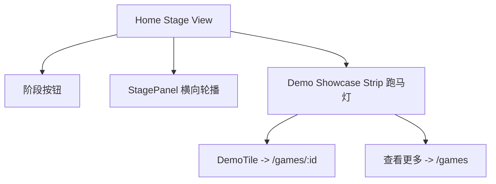

# Home Demo Showcase（首页游戏 Demo 缓慢移动展示）技术规格

## 1. 背景与目标
首页已切换为“游戏开发阶段视图”（Stage Panel 横向切换）。用户希望在该页面的卡片下方（参考截图红框区域）加入**游戏 Demo 的介绍与入口**，并且 Demo 列表能**缓慢移动变换**，提升动态氛围与可发现性。

目标：
- 首页即能看见 Demo（无需进入 /games）。
- Demo 与当前阶段联动（阶段切换时 Demo 推荐同步变化），同时保证有兜底内容。
- Demo 展示具备“缓慢移动变换”的动态效果，并支持用户手动拖拽/点击进入。
- 全站暗色高级感风格，UI 只使用 design token（语义类），不引入具体色硬编码。

非目标（本期不做）：
- 不实现真正可在线试玩 iframe（如 WebGL 内嵌），仅提供详情入口。
- 不接 Supabase 实时数据（先用 mockGames 验证体验，后续可替换数据源）。

## 2. 位置与信息架构
### 2.1 位置（对应截图红框）
在首页 Stage 视图中：
- StagePanel 卡片保持不变
- 在 StagePanel **下方新增一个横向展示区**：`Demo Showcase Strip`

该展示区宽度跟随内容区域（与 StagePanel 对齐），高度建议 160~220px，保证一眼看到 “Demo + 可点击入口”。

### 2.2 信息架构（用户路径）
- 用户浏览阶段卡 → 下方 Demo 展示区自动缓慢移动
- 用户点击某个 Demo → 跳转 `/games/:id`
- 用户点击“查看更多 Demo” → 跳转 `/games`

## 3. 数据源与筛选规则
### 3.1 当前可用数据
使用 `mockGames` 作为 MVP 数据源：
- 字段：`id/title/description/thumbnail/tags/likes/playCount/createdAt`
- 来源：`src/data/mock.ts`

### 3.2 阶段联动（推荐策略）
现有阶段数据：`aiToolchainData`，阶段包含 `tools[]`，每个 tool 有 `id`（同时作为 tag 体系的一部分）。

定义：
- `stageToolIds = stage.tools.map(t => t.id)`
- `stageGames = mockGames.filter(g => g.tags.some(tag => stageToolIds.includes(tag)))`

排序（建议）：
- 主排序：`playCount`（更像“可玩 Demo”）
- 次排序：`likes`
- 再次：`createdAt`（新鲜度）

兜底：
- 若 `stageGames.length < N`，则用 `mockGames` 全局热度榜补齐（避免空状态）。

### 3.3 展示数量
Demo Showcase Strip 建议展示 8~12 个 tile，便于形成“缓慢移动”的长条视觉。
- `N = 10`（建议默认）

## 4. UI 结构与组件设计
### 4.1 组件拆分
- `DemoShowcaseStrip`
  - props：`stageId` 或 `stageToolIds`
  - 产出：横向移动的 demo tile 列表 + 右侧 CTA（查看更多）
- `DemoTile`
  - 点击跳转 `/games/:id`
  - 展示缩略图、标题、描述（可选）、指标（play/likes）

### 4.2 Tile 视觉（暗色高级感）
仅使用语义 token 类（示例）：
- 容器：`bg-surface border border-border`
- tile：`bg-surface-2/60 hover:bg-surface-2 border border-border`
- 标题：`text-foreground`
- 描述：`text-muted-foreground`
- 高亮：`text-primary`、`bg-primary/10`、`border-primary/25`

DemoTile 建议信息密度：
- 左：缩略图（48~64px，圆角）
- 右：标题（1 行）+ 描述（1 行）
- 右下：`▶ {playCount}` `👍 {likes}`（小号字）

## 5. 动效规格（缓慢移动变换）
### 5.1 动效形式（推荐：无缝跑马灯 Marquee）
实现一个“横向无限循环滚动”的 marquee：
- 速度：`~40-70s` 走完一整轮（线性、非常慢）
- 方向：默认从右向左（或左向右，二选一）
- 交互：
  - hover：暂停（桌面）
  - pointer drag：可手动拖动滚动（桌面）
  - touch：原生横向滑动（移动端）

无缝循环策略：
- 将 demo 列表复制两份 `list = demos.concat(demos)`，用 CSS `translateX` 做循环位移
- 确保宽度足够时无“跳帧”感

### 5.2 “变换”效果（轻量增强）
为了更“高级”，可叠加轻微变化（不会抢眼）：
- tile：hover 时 `translateY(-1px)` + `shadow`（已在站内风格中使用）
- 背景：使用 `--brand-*` 做极低透明度的渐变光晕（不随时间变化或极慢变化）

### 5.3 降级与无障碍
当用户系统开启减少动态效果：
- `prefers-reduced-motion: reduce` 时禁用自动滚动
- 替代：静态横向滚动列表（可手动拖动）

## 6. 交互细节与冲突处理
首页已有“阶段轮播拖拽”，Demo Showcase Strip 属于**独立的横向区域**，为避免手势冲突：
- Demo Showcase Strip 的拖拽只作用于自身容器（不冒泡到阶段轮播）
- 点击 tile 需避免误触：沿用“拖拽阈值 + 拖拽后短时间拦截 click”的策略

## 7. 性能与实现约束
- 动效优先使用纯 CSS（GPU 友好）：
  - `transform: translate3d(...)` + `animation: linear infinite`
- Demo tile 数量控制在 10±2，不做大图，不用视频封面
- 图片 `draggable=false`，避免拖拽预览干扰

## 8. 路由与入口
- DemoTile 点击：`/games/:id`
- “查看更多 Demo”：`/games`
- 可选：支持带阶段 tag 的筛选（若 GameGallery 增加 tags 过滤）

## 9. Mermaid 结构图
### 9.1 首页阶段视图结构


### 9.2 数据选择流程
```mermaid
flowchart LR
  Stage[当前阶段] --> ToolIds[stage.tools[].id]
  ToolIds --> Filter[筛选 mockGames.tags overlaps toolIds]
  Filter --> Ranked[按 playCount/likes/createdAt 排序]
  Ranked --> Output[取前 N 个]
  AllGames[全量 mockGames] --> Fallback[不足 N 用全局补齐]
  Fallback --> Output
```

## 10. 验收标准（Checklist）
- 首页红框区域出现 Demo 展示区，能看到 demo 标题/描述/指标与入口
- Demo 展示区自动缓慢移动（肉眼可见但不打扰）
- hover 能暂停（桌面端），拖拽可手动滚动
- 点击 Demo 进入 `/games/:id`，点击“查看更多 Demo”进入 `/games`
- `prefers-reduced-motion` 时不自动移动
- 全部样式只使用 design token（语义类/变量），不引入具体色类

