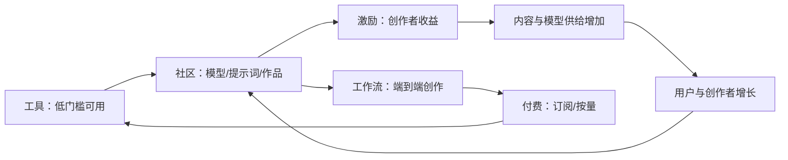
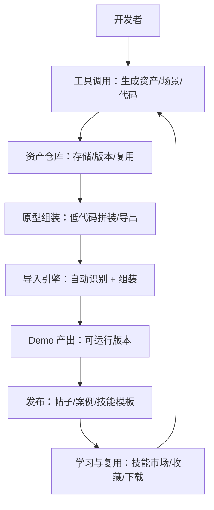

# Multi-Agent 社区产品探索（商业计划书 · 可视化版）

> 资料来源：`Multi-Agent 社区产品探索.docx`（内部文档摘录）。\
> 说明：文中关于 Liblib、即梦的用户/融资/营收等数据均来自该文档原文口径，未做外部二次核验。

***

## 1. 一句话定义

**做一个“AI 游戏开发的工具聚合 + 技能市场 + 社区 + Demo 展示/试玩”的一站式平台**，把“工具调用 → 产出资产 → 组装原型 → 分享学习 → 试玩传播”串成闭环，并用订阅/Token 实现商业化，同时为公司引擎与工具链导流。

***

## 2. 为什么现在做（Why Now）

| 维度    | 结论（文档摘录）               | 含义                    |
| ----- | ---------------------- | --------------------- |
| 市场趋势  | 60%+ 开发者使用 AI 开发，且持续上升 | AI 进入“普及期”，入口级产品窗口出现  |
| 生态空缺  | 游戏创作内容平台缺失、流量分散、缺系统化路径 | 需要“聚合 + 教程化 + 工作流化”产品 |
| 受众扩展  | 单一引擎受众有限且受舆情影响         | 平台化可覆盖更广开发者           |
| 可类比案例 | 文娱领域（图/视频）已出现成熟商业化案例   | 证明“工具→社区→工作流”可跑通商业闭环  |

***

## 3. 重点对标：Liblib 与 即梦（商业案例）

### 3.1 Liblib（工具 → 社区 → 全工作流）

**文档原话要点**

- 定位：不跟大模型公司竞争，做离用户最近的创作层
- 发展路径：工具（低门槛）→ 社区（模型/提示词/作品）→ 工作流（端到端专业工作室）
- 网络效应：模型越多 → 用户越多 → 创作者越多 → 模型更多
- 资本策略：快速融资，烧钱换规模
- 规模数据（文档口径）：3 年从 0 到 2500 万用户；2023.9–2025.10 共 5 轮融资，总额超 1.3 亿美元

**可复用的增长飞轮**

**对我们的启示（落到可执行）**

- 先用“工具聚合”切入形成日常使用，再叠加社区与激励形成供给侧壁垒
- 产品路线不要直接挑战基础模型能力，而要“贴近生产流程与协作场景”
- 形成“可复用资产/模板”的交易与分成体系，承接创作者增长与留存

***

### 3.2 即梦（AI 一站式图像/视频平台的规模化）

**文档原话要点**

- 规模数据（文档口径）：创作者 1500 万+，MAU 1200 万+；2026 年预计年化营收 25–30 亿
- 结构数据（文档口径）：游戏创作者占比约 8%（约 2–2.4 亿）

**对我们的启示（落到可执行）**

- 即使是非游戏垂类平台，也能在规模化后自然承接“游戏创作者”人群，说明游戏创作需求是可被平台化承载的
- 若我们做“更贴合游戏开发流程”的垂直平台，理论上可取得更高的转化与 ARPU（因为工具链更刚需、更高频）

***

## 4. 我们的定位与差异化

### 4.1 定位

- **一站式游戏开发平台**
- Core Target（文档）：**让游戏开发变得和做 PPT 一样简单**

### 4.2 为什么我们能做（文档优势）

- 有最直接的开发者社群资源
- API 调用与一站式开发方向与公司战略一致（算力与并发由团队兜底）
- 公司筹备训练数据（生成 UI/3D 等），平台可作为“数据库 + 工具 API”的分发入口

***

## 5. 产品形态（用“用户里程”串联）

### 5.1 用户里程（文档）

- 工具生态：工具使用 → 工具链依赖 → 工作流接入
- 内容生态：技能市场使用 → 案例分享/技术学习 → 游戏 demo 展示

### 5.2 端到端闭环（建议的产品主线）

***

## 6. 功能拆解（MVP → 增强）

### 6.1 MVP（文档第一阶段目标）

目标：**跑通一条“生成一个 demo 并在论坛上分享”的路径**

| 模块      | MVP 要求                            | 验收标准           |
| ------- | --------------------------------- | -------------- |
| 工具调用    | 至少 1 条可用工作流（例如：UI → 2D 资产 → 场景原型） | 内部同事可重复产出 demo |
| 技能市场    | 模板/Skill.md 发布、复制、收藏              | 形成可复用资产供给      |
| 社区内容    | 发帖 + 标签体系 + 热帖排序                  | 内容可沉淀并检索       |
| Demo 展示 | 首页/列表展示入口（试玩可先占位）                 | 作品可被发现与传播      |

### 6.2 冷启动（文档第二阶段）

在少数社群内推广，收集反馈，稳定功能，产出一定 DAU。

### 6.3 扩大规模（文档第三阶段方向）

引入激励与收益机制、完善工作流能力、提升“试玩”闭环转化。

***

## 7. 商业模式（Monetization）

| 模式         | 适用场景               | 备注             |
| ---------- | ------------------ | -------------- |
| 订阅（包月）     | 高频创作、团队协作、资产仓库与工作流 | 文档提出：包月        |
| Token/按量计费 | 大模型推理/3D/视频等高成本任务  | 文档提出：按 token   |
| 市场抽成（中后期）  | 技能/模板/资产交易与分成      | 对标“社区→工作流→商业化” |
| 导流与生态价值    | 引擎/插件/宿主平台的增长入口    | 战略价值（文档核心价值）   |

***

## 8. 风险与卡点（Stuck）与对策

| 文档卡点         | 风险描述                      | 建议对策（可执行）                           |
| ------------ | ------------------------- | ----------------------------------- |
| PlayFlow 过长  | 小游戏宿主需跳转 hub/connect，转化受损 | 提供 Web 端短链路试玩（WebGL/iframe）+ 宿主增强链路 |
| Web 调用工具 API | 成本、并发、稳定性挑战               | 配额/优先级队列/缓存复用/多模型分层                 |
| 美术管线与存储窗口    | 素材制作、存储、管理不完善             | 先做“素材仓库 + 版本 + 导出/导入”，再做编排式工作流      |

***

## 9. 关键指标（KPI）

### 北极星指标（建议）

**每周成功产出并发布“可复用技能/可玩 Demo”的创作者数**

### 过程指标

- 工具链：调用转化率、生成成功率、单位成本、平均耗时、复用率
- 内容：发帖/评论/收藏/下载、标签覆盖率、内容留存
- 试玩：点击试玩率、完成率、分享率、回流率
- 商业：订阅转化率、ARPU、Token 消耗结构、毛利率

***

## 10. 结论（文档逻辑的可视化总结）

> 文档结论类比：\
> **字节——剪映（终端制作工具）——即梦 AI（一站式 AI 图像/视频创作平台）**\
> 对应到我们：\
> **（终端制作工具/引擎）——AI 聚合游戏开发平台（入口 + 社区 + 工作流）**

核心要点：

- 先以“工具聚合”切入形成高频使用，再以“社区与市场”形成网络效应，最终走向“端到端工作流”与商业化闭环
- Liblib 的路径证明了“工具→社区→工作流”可做成规模与融资；即梦的数据证明“创作者规模化 + 商业化”在文娱赛道可成立，并能承接游戏创作者人群

