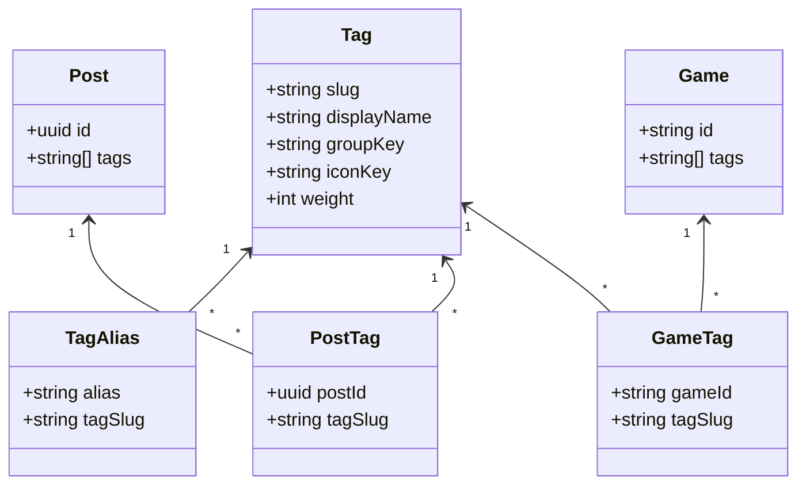
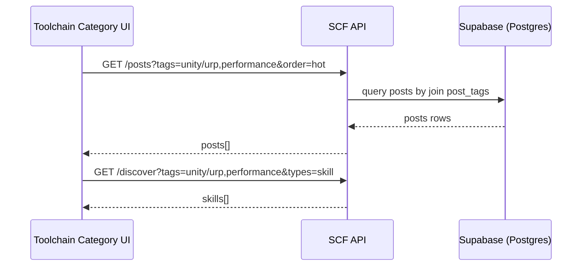

# Tag System Spec

## Goals

- Make community navigation/aggregation “tag-driven” and consistent across:
  - Forum (posts feed, hot/latest, topic search)
  - Skill market (skills)
  - Game demos (games)
  - AI toolchain (categories/tools)
- Enable automatic aggregation: “toolchain subpage shows matched hot posts + matched skills” based on shared tags.
- Provide an extensible tag structure: canonical tag identifiers, aliases/synonyms, grouping, ordering, and future metadata.

## Non-Goals (for the first iteration)

- Full-text search replacement (we only add tag-aware filtering/ranking).
- Complex personalization/recommendation (we use deterministic scoring).
- Breaking existing data model immediately (we support a gradual migration).

## Current State (Observed)

- Posts store `tags` as `text[]` (free-form strings).
- Games store `tags` as `text[]` (free-form strings).
- Skills are currently mock-driven; tags exist in mock data.
- Toolchain categories exist in `aiToolchainData` but have no shared tag contract with the forum.

## Proposed Architecture (Phased)

### Phase A — Introduce a Tag Registry + Canonicalization (No Breaking Changes)

1. Add a **Tag Registry** as a single source of truth for canonical tags.
2. Introduce **canonicalization** in both backend and frontend:
   - Normalize strings (trim, lower, replace spaces/underscores, strip punctuation)
   - Map alias → canonical tag (e.g., `ur p`/`urp` → `unity/urp`)
3. Keep existing `posts.tags` and `games.tags` as-is for now, but **treat them as inputs** that get normalized to canonical tags.

Outputs:
- A stable tag identifier (`tag_slug`) used across the product.
- UI can show pretty display names from the registry.

### Phase B — Add Tag Index Tables (For Efficient Querying + Reliable Aggregation)

Create join tables maintained by triggers so we can query by tags efficiently and avoid fragile array queries:

- `post_tags(post_id, tag_slug)`
- `game_tags(game_id, tag_slug)`
- (optional, when skills become DB-backed) `skill_tags(skill_id, tag_slug)`

Maintain these via triggers on `posts`/`games` that:
- Read `tags` array (free-form)
- Canonicalize each entry
- Insert/delete join table rows accordingly

Benefits:
- Fast filtering: `where tag_slug in (...)`
- Easy scoring by overlap counts
- Future-proof: tags become first-class, no longer “just strings in an array”

### Phase C — Tag-Driven Discovery APIs

Add APIs that return relevant content across modules using canonical tags:

- `GET /tags` → returns registry with metadata
- `GET /posts?tags=tag1,tag2&order=hot|latest` → tag-filtered posts
- `GET /games?tags=...` → tag-filtered games
- `GET /discover?tags=...&types=post,skill,game&limit=...` → mixed discovery payload

### Phase D — Product Integration

1. **Toolchain category → tag set mapping**
   - Each toolchain category gets a list of canonical tags.
   - Example: “2D/3D 美术与动画” maps to `art/pixel`, `art/3d`, `animation`, `unity/shadergraph`, etc.
2. **Toolchain subpage aggregation**
   - When user enters a toolchain category:
     - Fetch hot posts: `/posts?tags=...&order=hot`
     - Fetch skills: local skill index filtered by tags (Phase A) or `/discover` (Phase C)
3. **Topic search**
   - Search box supports:
     - Free-text (existing behavior)
     - Tag chips / tag filter drawer
   - Clicking a tag navigates to `/?tags=unity/urp,performance` and the feed filters accordingly.

## Data Model

### Tag Registry (DB-backed)

Minimal schema:

- `tags`
  - `slug text primary key` (canonical identifier, stable)
  - `display_name text not null`
  - `group_key text null` (e.g., `engine`, `rendering`, `network`)
  - `description text null`
  - `icon_key text null`
  - `weight integer not null default 10` (ranking bias)
  - `created_at timestamptz default now()`

- `tag_aliases`
  - `alias text primary key` (normalized form)
  - `tag_slug text not null references tags(slug)`

Join tables:
- `post_tags(post_id uuid references posts(id) on delete cascade, tag_slug text references tags(slug), primary key(post_id, tag_slug))`
- `game_tags(game_id text references games(id) on delete cascade, tag_slug text references tags(slug), primary key(game_id, tag_slug))`

Indexes:
- `post_tags(tag_slug, post_id)`
- `game_tags(tag_slug, game_id)`

RLS:
- Select: public
- Insert/Delete: via triggers (security definer function) or authenticated service role in SCF

### Frontend Tag Representation

```ts
export type Tag = {
  slug: string;
  displayName: string;
  groupKey?: string | null;
  iconKey?: string | null;
  weight?: number;
  aliases?: string[];
};
```

## Canonicalization Rules

1. `normalize(input)`:
   - `trim()`
   - `toLowerCase()`
   - collapse whitespace to `-`
   - remove non-alphanumeric except `-` and `/`
2. Alias mapping:
   - if `normalize(input)` in `tag_aliases`, return mapped canonical `tag_slug`
3. Otherwise:
   - allow only tags that exist in registry (strict mode) OR create “unregistered” tags (lenient mode)

Recommended:
- **Strict mode for UI suggestions** (encourages consistency)
- **Lenient mode for ingestion** (doesn’t block users; logs unknown tags for curation)

## Ranking / Matching Algorithm

### Overlap Score (Simple + Deterministic)

For a candidate content item with tags `C` and context tags `T`:

- `overlap = |C ∩ T|`
- `jaccard = overlap / |C ∪ T|`
- `weightSum = Σ weight(tag) for tag in (C ∩ T)`

Final score (example):

`score = 0.55 * jaccard + 0.35 * (weightSum / 100) + 0.10 * recencyBoost`

Where:
- `recencyBoost` is normalized from created_at (e.g., last 7 days = 1, older = 0)

### “Hot posts” under toolchain

- Start from `/posts?order=hot&tags=...`
- If “hot” is not DB-driven yet, approximate: sort by `likes + 0.5*commentsCount + recency`

## API Contracts (SCF)

### GET /tags

Response:

```json
{
  "data": [
    { "slug": "unity/urp", "display_name": "URP", "group_key": "rendering", "icon_key": "urp", "weight": 20 }
  ],
  "requestId": "..."
}
```

### GET /posts?tags=...&order=hot|latest

- tags is optional. If present, filter by tags overlap >= 1.
- order:
  - latest: `created_at desc`
  - hot: computed in query via likes/comments (or future materialized view).

### GET /discover?tags=...&types=post,skill,game

Response groups:

```json
{
  "data": {
    "posts": [],
    "skills": [],
    "games": []
  },
  "requestId": "..."
}
```

## UI Integration Plan

### Toolchain Subpage (Category View)

1. Each category defines `categoryTags: string[]` (canonical slugs)
2. On view:
   - Fetch posts: `/posts?tags=...&order=hot`
   - Fetch skills: filter local skill index by tag overlap (Phase A) OR `/discover`
3. Render:
   - Top 5 hot posts
   - Top 8 matched skills

### Topic Search

1. Add tag chips + tag picker (from `/tags`)
2. Apply selected tags to feed query:
   - `/?tags=unity/urp,performance`
3. Feed uses tag filter query params to request `/posts?tags=...`

## Migration Plan

1. Add tags registry tables + seed initial canonical tags/aliases.
2. Add join tables `post_tags`/`game_tags`.
3. Add triggers to keep join tables in sync with `posts.tags`/`games.tags`.
4. Update SCF endpoints to support `tags` query param.
5. Update frontend:
   - Tag picker uses registry
   - Toolchain category view uses tags to aggregate posts/skills

## Mermaid Diagrams

### Class Diagram



### Sequence Diagram (Toolchain → Aggregated Content)



