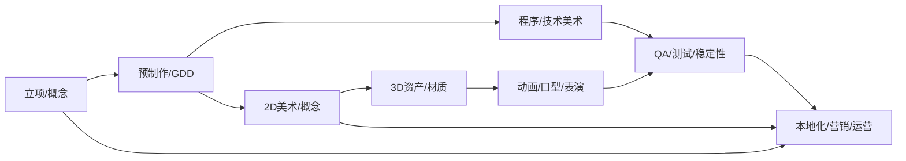

# 游戏开发 AI 工具链（国内工具优先版）

> 目标：按游戏开发完整流程梳理常用 AI 工具，优先列出国内可用产品与开源生态，并在每个流程首先总结“流程主要工作”，同时提供“AI工作流”和“注意事项”，便于落地。

## 目录
- [总览：流程 × 能力层图](#overview)
- [立项 / 概念](#ideation)
- [预制作 / GDD / 原型](#preprod)
- [2D 美术 / 概念设计 / UI](#art2d)
- [3D 资产 / 场景 / 材质](#art3d)
- [动画 / 表演 / 口型](#animation)
- [程序 / 技术美术](#coding)
- [音频 / 配音 / 音乐 / 音效](#audio)
- [QA / 自动化测试 / 稳定性](#qa)
- [本地化 / 营销 / 运营](#liveops)
- [使用与整合建议](#suggestions)

## 流程总览

---

## 总览：流程 × 能力层图

```mermaid
flowchart TB
  subgraph 通用大模型
    G0A[立项] --> G0B[预制作]
    G0B --> G0C[2D]
    G0C --> G0D[3D]
    G0D --> G0E[动画]
    G0B --> G0F[程序]
    G0F --> G0G[QA]
    G0G --> G0H[运营]
  end

  subgraph 搜索/调研
    S1A[立项] --> S1B[预制作]
    S1B --> S1H[运营]
  end

  subgraph 文档/协作
    D2A[预制作] --> D2B[程序]
    D2B --> D2C[QA]
    D2C --> D2D[运营]
  end

  subgraph 图像生成
    I3A[2D] --> I3B[运营素材]
  end

  subgraph 3D/重建
    G4A[3D资产] --> G4B[程序]
  end

  subgraph 动画/动捕
    M5A[动画] --> M5B[程序]
  end

  subgraph 代码/工程
    C6A[程序] --> C6B[构建/发布]
    C6B --> C6C[QA]
  end

  subgraph 音频/配音
    A7A[音频] --> A7B[程序适配]
  end

  subgraph 观测/QA
    Q8A[QA] --> Q8B[发布门槛]
  end

  subgraph 本地化/运营
    L9A[本地化] --> L9B[营销素材]
    L9B --> L9C[活动/A-B]
  end
```

---

## 立项 / 概念（Ideation）

**流程主要工作（摘要）**
- 做什么：确定目标用户、平台与商业模式，收敛核心玩法与差异化方向，评估风险与资源边界
- 出什么结果：立项方案（含核心循环）、风险清单、原型验证指标与里程碑

**AI工作流**
- 输入题材/平台/商业模式与受众画像
- 生成3–5套玩法方向与核心循环草案
- 输出风险矩阵（技术/成本/差异化/合规）
- 选1–2套进入原型门槛与评审材料
- 固化为协作文档与里程碑

**工具（分类）**

**通用大模型**
| 工具 | 用途简述 | 生态/备注 |
|---|---|---|
| 通义千问（Qwen） | 脑暴玩法/系统拆解/结构化写作 | 阿里 |
| 文心一言（ERNIE Bot） | 调研与长文摘要、中文资料友好 | 百度 |
| Kimi（月之暗面） | 长文阅读/多文件梳理/表格摘要 | 月之暗面 |
| 混元（Tencent） | 问答与方案草拟、微信生态接入 | 腾讯 |
| 智谱GLM | 中文推理与结构化输出 | 智谱 |

**搜索 / 调研**
| 工具 | 用途简述 | 生态/备注 |
|---|---|---|
| 秘塔AI搜索 | 带来源的检索与分析总结 | 国内搜索 |

**注意事项**
- AI不能代替资方/团队的可行性判断与资源分配
- 无真实用户与数据验证时，容易高估可玩性与市场空间
- 题材与品牌选择需经验与风险承受力，AI不可独断

**阶段输出物（清单）**
- [ ] 立项方案与核心循环草案
- [ ] 竞品矩阵与差异化分析
- [ ] 风险清单与应对策略
- [ ] 原型门槛与验证指标
- [ ] 项目里程碑与资源预算

---

## 预制作 / GDD / 原型

**流程主要工作（摘要）**
- 做什么：把设计与技术方案写清楚并做可玩原型验证，建立资产规范与协作流程
- 出什么结果：GDD/TDD、原型Demo与验收标准、风格基准/命名规范、埋点字典与评审看板

**AI工作流**
- 生成GDD/TDD初稿并迭代评审
- 建立原型清单与门槛，快速做NPC/对话/系统原型
- 输出埋点事件字典与验收标准
- 任务拆分与变更摘要进入知识库与看板

**工具（分类）**

**文档 / 知识库 / 协作**
| 工具 | 用途简述 | 生态/备注 |
|---|---|---|
| 飞书文档（AI/妙记） | 会议纪要/文档生成/协同 | 飞书 |
| 钉钉文档（智能协作） | 文档与表格协同/流程沉淀 | 钉钉 |
| 腾讯文档（智能助手） | 评审要点提炼/任务协作 | 腾讯 |
| 语雀（智能写作） | 规范化设计文档与知识库 | 阿里 |

**对话 / NPC 原型**
| 工具 | 用途简述 | 生态/备注 |
|---|---|---|
| Inworld Studio | NPC人格与对话原型 | 在线/国内可访问备用 |

**注意事项**
- 系统边界与技术选型需资深工程与制作人拍板
- 原型好不好玩需试玩与数据，不是文本推断
- 安全、合规条款不可由AI自动决定

**阶段输出物（清单）**
- [ ] GDD/TDD 文档与评审记录
- [ ] 原型 Demo 与验收标准
- [ ] 风格基准与资产命名规范
- [ ] 埋点事件字典与数据方案
- [ ] 任务看板与里程碑

---

## 2D 美术 / 概念设计 / UI

**流程主要工作（摘要）**
- 做什么：探索并统一美术风格与UI语言，快速产出概念与占位素材，支持原型与内容制作
- 出什么结果：风格基准板、UI组件/图标规范、关键概念稿与可落地的资产交付标准

**AI工作流**
- 定义风格约束（题材/色彩/受众/品牌）
- 生成多轮概念稿与氛围图
- 固化为风格基准板与UI规范
- 批量出占位素材供原型使用
- 进入手工精修与可商用流程

**工具（分类）**

**图像生成（国内）**
| 工具 | 用途简述 | 生态/备注 |
|---|---|---|
| 通义万相 | 图像生成/风格探索 | 阿里 |
| 文心图像（ERNIE-ViLG） | 中文指令友好/风格迭代 | 百度 |

**本地 / 私有化**
| 工具 | 用途简述 | 生态/备注 |
|---|---|---|
| Stable Diffusion + ComfyUI | 本地/私有部署可控 | 开源 |

**设计物料 / 模板**
| 工具 | 用途简述 | 生态/备注 |
|---|---|---|
| 火山引擎 · 智能设计能力 | 海报/素材生成与迭代 | 字节 |
| 稿定设计 / 创客贴 / 图怪兽 | 营销图与模板化设计 | 国内平台 |

**注意事项**
- 商用资产需版权可控，生成图常需重绘或复刻
- 风格一致性与品牌约束由资深美术把控
- 关键角色与标识不可直接用AI量产替代

**阶段输出物（清单）**
- [ ] 风格基准板与情绪板
- [ ] UI 组件与图标规范
- [ ] 关键概念稿与占位素材集
- [ ] 品牌与版权台账
- [ ] 资产交付与版本规范

---

## 3D 资产 / 场景 / 材质

**流程主要工作（摘要）**
- 做什么：把角色/场景从白模做到引擎可用，补齐拓扑UV、材质、LOD与碰撞，并做性能与Streaming验证
- 出什么结果：可上引擎的3D资产包（含LOD/碰撞/材质）、性能预算达标报告、入库与打包产物

**AI工作流**
- 文/图生3D生成白模与参考网格
- 材质生成工具做贴图初稿与材质球
- DCC手工：拓扑、UV、LOD、碰撞
- 引擎内验证性能与Streaming分块
- 资产审核入库与自动打包

**工具（分类）**

**3D 重建 / 扫描**
| 工具 | 用途简述 | 生态/备注 |
|---|---|---|
| Nerfstudio + 高斯点云 | 扫描/视频到3D重建 | 开源 |
| COLMAP / OpenMVS | 传统SfM/MVS建模 | 开源 |

**材质 / 贴图**
| 工具 | 用途简述 | 生态/备注 |
|---|---|---|
| Substance 3D（材质） | 贴图与材质生成/编辑 | Adobe |

**DCC / 管线**
| 工具 | 用途简述 | 生态/备注 |
|---|---|---|
| Blender + 插件 | 本地管线与批处理 | 开源 |

**生成参考**
| 工具 | 用途简述 | 生态/备注 |
|---|---|---|
| SD/ControlNet 3D参考 | 参考到白模过渡 | 开源 |

**注意事项**
- 拓扑/UV/LOD/碰撞与优化必须由专业3D美术完成
- 性能与内存预算达标需引擎内验证与调优
- 骨骼与蒙皮复杂资产难以AI一次到位

**阶段输出物（清单）**
- [ ] 角色/场景资产包（含LOD/碰撞）
- [ ] 材质与贴图集合（规范命名）
- [ ] 性能预算与Streaming验证报告
- [ ] 资产入库与自动打包产物
- [ ] 预览截图与Meta数据

---

## 动画 / 表演 / 口型

**流程主要工作（摘要）**
- 做什么：采集/生成并修正动作与口型，搭建状态机与过场表现，保证动作质量与玩法可用
- 出什么结果：动作库与过渡、口型/表情资产、状态机配置、过场资源与验收结果

**AI工作流**
- 采集或生成动作初稿并重定向到骨骼
- 动画师做关键帧修正与表演细节
- 配音驱动口型，完善表情与镜头
- 引擎内状态机与BlendSpace配置与测试
- 性能与内存验证后入库与版本化

**工具（分类）**

**动捕 / 清洗 / 重定向**
| 工具 | 用途简述 | 生态/备注 |
|---|---|---|
| Rokoko Vision | 摄像头动捕/清洗/重定向 | Rokoko |
| Move.ai | 无标记动捕/多人支持 | 专业 |

**视频驱动 / 动作生成**
| 工具 | 用途简述 | 生态/备注 |
|---|---|---|
| DeepMotion | 文/视频驱动动作生成与重定向 | 在线 |
| RADiCAL | 视频到3D骨骼动作 | 在线 |

**动作编辑**
| 工具 | 用途简述 | 生态/备注 |
|---|---|---|
| Plask | 浏览器内动作生成与编辑 | 在线 |

**注意事项**
- 表演质量与风格统一由动画师把控
- 与玩法逻辑/碰撞反馈的精细耦合需人工调试
- 过场叙事与镜头语言不能完全交由AI创作

**阶段输出物（清单）**
- [ ] 动作库与过渡配置
- [ ] 口型/表情驱动资产
- [ ] 状态机与 BlendSpace 配置
- [ ] 过场资源包与分镜预览
- [ ] 验收与性能验证记录

---

## 程序 / 技术美术（Coding / Tech Art）

**流程主要工作（摘要）**
- 做什么：实现核心系统与工具链，打通构建发布流程，持续做性能与稳定性优化
- 出什么结果：可运行的版本、关键系统与工具、CI/门禁、性能数据与稳定性指标

**AI工作流**
- 在约束清晰（平台/帧率/内存/风格）前提下用AI补全
- 生成单元/集成测试与管线脚本接入CI
- 对关键模块进行人工评审与Profile
- 文档与变更说明生成并人工审核
- 版本化与门禁（lint/typecheck）

**工具（分类）**

**代码助手（国内/开源）**
| 工具 | 用途简述 | 生态/备注 |
|---|---|---|
| 通义灵码（Lingma） | 代码补全/重构/文档生成 | 阿里 |
| 百度 Comate | IDE内代码助手/规范建议 | 百度 |
| CodeGeeX | 中文代码模型/本地可用 | 开源 |

**工程平台 / DevOps**
| 工具 | 用途简述 | 生态/备注 |
|---|---|---|
| 华为云 CodeArts | 代码生成/测试/DevOps集成 | 华为云 |
| 腾讯云开发助手 | 云端开发与AI辅助 | 腾讯云 |

**注意事项**
- 架构与性能关键路径需资深工程决策
- 引擎/平台细节与坑位需经验与实测
- 安全/反作弊/网络时序不可交由AI自动改动

**阶段输出物（清单）**
- [ ] 可运行版本与变更说明
- [ ] 关键系统模块与工具链
- [ ] CI/门禁（lint/typecheck/tests）
- [ ] Profile 报告与优化清单
- [ ] 构建与发布流水线文档

---

## 音频 / 配音 / 音乐 / 音效

**流程主要工作（摘要）**
- 做什么：完成配音、音乐与音效制作，并在引擎里做触发、混音与平台适配
- 出什么结果：可用音频资产库（多语/音乐/音效）、混音规则与参数、交付规范与验收

**AI工作流**
- 生成占位配音与音乐Demo验证氛围与节奏
- 确定风格后进入专业配音与作曲录制
- 引擎内做音效与混音的动态适配
- 多语本地化与术语表校对
- 资产版本化与运行时优化

**工具（分类）**

**语音合成（专业/平台）**
| 工具 | 用途简述 | 生态/备注 |
|---|---|---|
| 科大讯飞 TTS | 中文合成/情感语音 | 讯飞 |
| 百度语音合成 | 多风格TTS/中文友好 | 百度 |

**语音合成（云厂商）**
| 工具 | 用途简述 | 生态/备注 |
|---|---|---|
| 腾讯云语音合成 | TTS与语音识别一体 | 腾讯云 |
| 阿里云智能语音 | 语音合成/多语支持 | 阿里云 |
| 火山引擎 · 语音合成 | 中文TTS与播报 | 字节 |

**注意事项**
- 主角与关键剧情需要专业配音与导演把控
- 音乐主题一致性与版权/授权必须明确
- 声音肖像权与法律链条不可由AI替代

**阶段输出物（清单）**
- [ ] 配音/音乐/音效资产库
- [ ] 引擎混音规则与参数
- [ ] 触发与适配脚本
- [ ] 交付规范与版本台账
- [ ] 听感与情感传达验收报告

---

## QA / 自动化测试 / 稳定性

**流程主要工作（摘要）**
- 做什么：覆盖功能/性能/兼容测试，建设自动化与观测，持续定位与修复问题
- 出什么结果：测试报告与已知问题清单、稳定性指标达标、发布门槛与回滚预案

**AI工作流**
- 接入日志/崩溃/埋点到观测平台
- 用AI做异常聚类与根因候选列表
- 人工复核后转为任务与修复PR
- 自动化测试更新并接入CI门禁
- 发布后复盘与指标跟踪

**工具（分类）**

**观测 / APM（云厂商）**
| 工具 | 用途简述 | 生态/备注 |
|---|---|---|
| 阿里云 ARMS | 应用性能/日志/告警 | 阿里云 |
| 腾讯云观测（APM/日志） | 性能与日志观测/拨测 | 腾讯云 |
| 火山引擎 · 观测云 | 日志/指标/链路追踪 | 字节 |
| 华为云 APM | 性能监控与诊断 | 华为云 |

**观测（本土/开源方案）**
| 工具 | 用途简述 | 生态/备注 |
|---|---|---|
| OneAPM 听云 / 美团 CAT | APM与链路/开源观测 | 国内生态 |

**注意事项**
- 测试设计与验收标准需资深QA与工程制定
- 安全/反作弊、网络时序问题必须工程实测
- 合规与评级审核不可由AI代办

**阶段输出物（清单）**
- [ ] 功能/性能/兼容测试报告
- [ ] 已知问题清单与修复计划
- [ ] 观测与告警仪表盘
- [ ] 发布门槛与回滚预案
- [ ] 复盘总结与指标趋势

---

## 本地化 / 营销 / 运营（LiveOps）

**流程主要工作（摘要）**
- 做什么：做多语本地化、营销素材与社区客服支持，规划版本活动并用数据复盘迭代
- 出什么结果：多语内容与术语库、活动/素材投放包、运营日历、数据报表与复盘结论

**AI工作流**
- 建立术语表与风格指南，AI辅助初译与校对
- 生成与迭代营销素材，进入人审与品牌把关
- 社区/客服数据接入做分类与摘要，人工回复定稿
- 活动方案与A/B结果总结形成复盘
- 运营日历与内容节奏落地

**工具（分类）**

**翻译 / 本地化**
| 工具 | 用途简述 | 生态/备注 |
|---|---|---|
| 百度/有道/腾讯翻译君 | 多语翻译与术语管理 | 国内平台 |
| 火山引擎 · 机器翻译 | 企业级翻译与术语库 | 字节 |
| 阿里云 · 机器翻译 | API与平台集成 | 阿里云 |

**视频 / 素材生产**
| 工具 | 用途简述 | 生态/备注 |
|---|---|---|
| 剪映 / 快影 | 短视频生成与迭代 | 国内平台 |
| 稿定设计 / 创客贴 | 海报/模板与素材管理 | 国内平台 |

**注意事项**
- 文化适配与敏感内容需本地化专家与法务审核
- 品牌一致性与调性由市场与美术把控
- 数据驱动策略的最终拍板由业务与制作人决策

**阶段输出物（清单）**
- [ ] 多语文案与术语库
- [ ] 活动与素材投放包
- [ ] 社区客服分类与模板
- [ ] 运营日历与节奏
- [ ] 数据报表与复盘结论

---

## 使用与整合建议

- 先从“代码助手 + 文档助手”落地，ROI稳定
- 美术侧从“风格探索”起步，逐步走向“可商用资产流程”，注意授权与台账
- NPC/叙事先做小场景原型验证玩法与成本
- QA/稳定性需要埋点与日志基础设施，AI擅长聚类与归因
- 国内与海外合规差异较大，上线前复核训练数据/授权范围
- 安全与合规条款不能由AI自动决定

---

## 基座模型目录（按能力分类）

**通用对话/多模态**
| 模型 | 能力 | 生态/备注 |
|---|---|---|
| OpenAI GPT-4o / GPT-4 Turbo | 文本/多模态对话 | 商用/API |
| Anthropic Claude 3/3.5 | 长文本/安全对话 | 商用/API |
| Google Gemini 1.5 Pro/Flash | 多模态/长上下文 | 商用/API |
| Meta Llama 3（8B/70B） | 开源/可本地部署 | 开源/推理 |
| Mistral Large / Mixtral 8x7B | 开源/稀疏专家 | 开源/商用 |
| Cohere Command R / R+ | 检索/企业对话 | 商用/API |
| xAI Grok-1 | 英文对话/推理 | 商用/API |
| 阿里 通义 Qwen-72B/14B 等 | 中文/多模态家族 | 国内/开源+商用 |
| 百度 文心 ERNIE 4.x | 中文对话/企业生态 | 国内/商用 |
| 腾讯 混元（Hunyuan） | 中文对话/生态接入 | 国内/商用 |
| 智谱 GLM-4/GLM-4-Air | 中文/开源家族 | 国内/开源+商用 |
| 01.AI Yi-34B/6B | 中文/开源家族 | 国内/开源 |
| 百川 Baichuan 2 | 中文/推理 | 国内/开源+商用 |
| MiniMax abab | 中文对话/多模态 | 国内/商用 |

**图像生成**
| 模型 | 能力 | 生态/备注 |
|---|---|---|
| Stable Diffusion XL / SD3 | 文生图/可私有部署 | 开源 |
| Midjourney | 高质量文生图 | 在线服务 |
| Adobe Firefly | 品牌友好生成 | 商用 |
| 通义 万相 | 中文文生图 | 国内/商用 |
| ERNIE-ViLG | 中文文生图 | 国内/商用 |
| DALL·E 3 | 文生图 | 商用 |

**视频 / 3D / 重建**
| 模型/服务 | 能力 | 生态/备注 |
|---|---|---|
| Runway Gen-3 | 文生视频 | 在线服务 |
| Pika | 短视频生成 | 在线服务 |
| Luma / Nerfstudio | NeRF/重建 | 服务/开源 |
| Gaussian Splatting | 重建技术 | 开源技术 |

**音频 / 语音**
| 模型 | 能力 | 生态/备注 |
|---|---|---|
| OpenAI Whisper | 语音转写（ASR） | 开源 |
| Coqui TTS | 文本转语音 | 开源 |
| Tacotron / HiFi-GAN | 语音合成链路 | 开源 |
| 科大讯飞/百度/腾讯/阿里 语音 | TTS/ASR | 国内/云服务 |

**代码 / 开发**
| 模型 | 能力 | 生态/备注 |
|---|---|---|
| CodeLlama | 代码补全/生成 | 开源 |
| StarCoder | 代码模型 | 开源 |
| DeepSeek-Coder | 中文代码模型 | 国内/开源 |
| Qwen-Coder | 中文代码模型 | 国内/开源 |
| GLM Code | 中文代码模型 | 国内/开源 |

> 以上为常用/主流的基座模型与服务组合，实际选型建议结合场景（隐私、延迟、成本、许可证）做“首选/备选”搭配，并在文档对应流程的能力层下标注。

---

## 全工具目录（能力层与流程覆盖）

说明：为便于总览，以下按“能力层”分组列出主要工具，并标注其“覆盖流程”。流程标签映射：Ideation（立项）、Preprod（预制作）、2D、3D、Animation、Coding、Audio、QA、LiveOps。

**通用大模型（FM）**
| 工具 | 能力层 | 覆盖流程 | 生态/备注 |
|---|---|---|---|
| 通义千问（Qwen） | 通用大模型 | Ideation/Preprod/Coding/QA/LiveOps | 阿里 |
| 文心一言（ERNIE Bot） | 通用大模型 | Ideation/Preprod/Coding/QA/LiveOps | 百度 |
| Kimi（月之暗面） | 通用大模型 | Ideation/Preprod | 月之暗面 |
| 混元（Tencent） | 通用大模型 | Ideation/Preprod/LiveOps | 腾讯 |
| 智谱GLM | 通用大模型 | Ideation/Preprod/Coding/QA/LiveOps | 智谱 |
| GPT-4o/4 Turbo | 通用大模型 | Ideation/Preprod/Coding/QA/LiveOps | 商用 |
| Claude 3/3.5 | 通用大模型 | Ideation/Preprod/Coding/QA/LiveOps | 商用 |
| Gemini 1.5 | 通用大模型 | Ideation/Preprod | 商用 |
| Llama 3（开源） | 通用大模型 | Ideation/Preprod/Coding | 开源 |

**搜索 / 调研**
| 工具 | 能力层 | 覆盖流程 | 生态/备注 |
|---|---|---|---|
| 秘塔AI搜索 | 搜索/调研 | Ideation/Preprod/LiveOps | 国内搜索 |
| Perplexity | 搜索/调研 | Ideation/Preprod | 在线 |

**文档 / 协作 / 知识库**
| 工具 | 能力层 | 覆盖流程 | 生态/备注 |
|---|---|---|---|
| 飞书文档（AI/妙记） | 文档/协作 | Preprod/Coding/QA/LiveOps | 飞书 |
| 钉钉文档（智能协作） | 文档/协作 | Preprod/Coding/QA | 钉钉 |
| 腾讯文档（智能助手） | 文档/协作 | Preprod/Coding/QA | 腾讯 |
| 语雀（智能写作） | 知识库 | Preprod/Coding/QA | 阿里 |
| Notion AI | 文档/协作 | Preprod/Coding/QA | 在线 |

**图像生成 / 设计物料**
| 工具 | 能力层 | 覆盖流程 | 生态/备注 |
|---|---|---|---|
| 通义万相 | 图像生成 | 2D/LiveOps | 阿里 |
| ERNIE-ViLG | 图像生成 | 2D/LiveOps | 百度 |
| Stable Diffusion + ComfyUI | 图像生成（本地/私有） | 2D | 开源 |
| 火山引擎 · 智能设计 | 设计物料/模板 | 2D/LiveOps | 字节 |
| 稿定/创客贴/图怪兽 | 设计物料/模板 | LiveOps | 国内平台 |
| Midjourney | 图像生成 | 2D/LiveOps | 在线 |
| Adobe Firefly | 图像生成 | 2D/LiveOps | 商用 |

**3D / 重建 / DCC / 材质**
| 工具 | 能力层 | 覆盖流程 | 生态/备注 |
|---|---|---|---|
| Nerfstudio + 高斯点云 | 3D重建 | 3D | 开源 |
| COLMAP / OpenMVS | 3D重建 | 3D | 开源 |
| Luma | 3D重建 | 3D | 在线 |
| Blender + 插件 | DCC/管线 | 3D | 开源 |
| Substance 3D | 材质/贴图 | 3D | Adobe |
| Stable Diffusion + ControlNet 3D参考 | 生成参考 | 3D | 开源 |

**动画 / 动捕 / 动作编辑**
| 工具 | 能力层 | 覆盖流程 | 生态/备注 |
|---|---|---|---|
| Rokoko Vision | 动捕/清洗/重定向 | Animation | Rokoko |
| Move.ai | 无标记动捕 | Animation | 专业 |
| DeepMotion | 视频驱动/动作生成 | Animation | 在线 |
| RADiCAL | 视频到骨骼动作 | Animation | 在线 |
| Plask | 动作编辑 | Animation | 在线 |

**代码 / 工程 / DevOps**
| 工具 | 能力层 | 覆盖流程 | 生态/备注 |
|---|---|---|---|
| 通义灵码（Lingma） | 代码助手 | Coding/QA | 阿里 |
| 百度 Comate | 代码助手 | Coding/QA | 百度 |
| CodeGeeX | 代码助手（开源） | Coding | 开源 |
| 华为云 CodeArts | DevOps/生成/测试 | Coding/QA | 华为云 |
| 腾讯云开发助手 | 云端开发/AI辅助 | Coding | 腾讯云 |
| GitHub Copilot | 代码助手 | Coding | 在线 |

**音频 / 语音（TTS/ASR）**
| 工具 | 能力层 | 覆盖流程 | 生态/备注 |
|---|---|---|---|
| 科大讯飞 TTS | 语音合成 | Audio | 讯飞 |
| 百度语音合成 | 语音合成 | Audio | 百度 |
| 腾讯云语音合成 | 语音合成 | Audio | 腾讯云 |
| 阿里云智能语音 | 语音合成 | Audio | 阿里云 |
| 火山引擎 · 语音合成 | 语音合成 | Audio | 字节 |
| OpenAI Whisper | 语音转写 | Audio | 开源/在线 |

**观测 / QA / 稳定性**
| 工具 | 能力层 | 覆盖流程 | 生态/备注 |
|---|---|---|---|
| 阿里云 ARMS | 观测/APM | QA/LiveOps | 阿里云 |
| 腾讯云观测（APM/日志） | 观测/APM | QA/LiveOps | 腾讯云 |
| 火山引擎 · 观测云 | 观测/APM | QA/LiveOps | 字节 |
| 华为云 APM | 观测/APM | QA/LiveOps | 华为云 |
| OneAPM 听云 / 美团 CAT | 观测/APM | QA/LiveOps | 国内生态 |

**本地化 / 运营 / 素材**
| 工具 | 能力层 | 覆盖流程 | 生态/备注 |
|---|---|---|---|
| 百度/有道/腾讯翻译君 | 翻译/术语 | LiveOps | 国内平台 |
| 火山引擎 · 机器翻译 | 翻译/术语 | LiveOps | 字节 |
| 阿里云 · 机器翻译 | 翻译/术语 | LiveOps | 阿里云 |
| 剪映 / 快影 | 视频素材 | LiveOps | 国内平台 |
| 稿定/创客贴 | 海报/模板 | LiveOps | 国内平台 |
